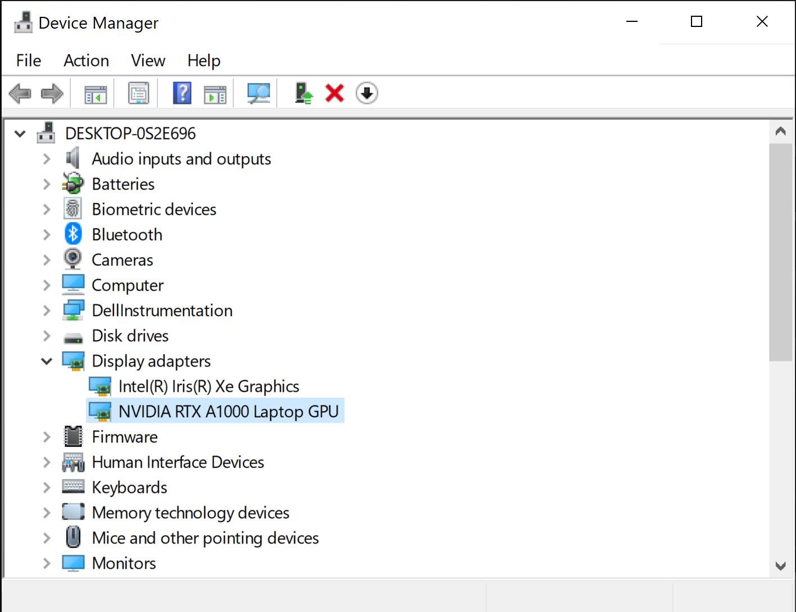
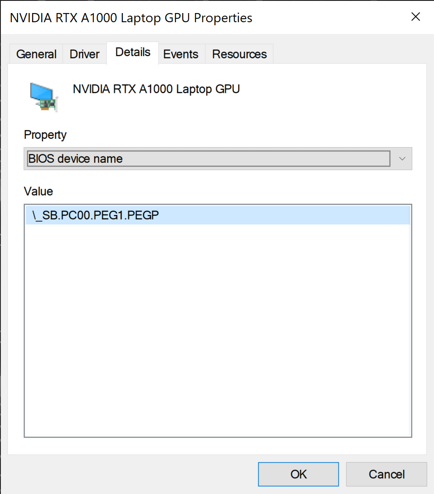

# `acpi_call_finder`

This is a small script I wrote to help me figure out which ACPI method was needed to disable the discrete GPU in a laptop.

**Disclaimer**: This comes with no warranty of any kind, etc. See the `acpi_call` notes for how this works under the hood.
I don't pretend to know how any of this works, I just wrote this script to help me find the method that worked for my GPU.

## Usage

Requirements:

* `acpi_call` installed and its module loaded
  * Depending on your distribution, it's something like `modprobe acpi_call` or `insmod acpi_call.ko`
* `nodejs` installed (this script is written in JavaScript)
  * if you don't want to install `nodejs`, just look at the script, it's very simple to replicate
* `root` privileges - the script must run as `root`


Run the script with a list of "BIOS device names" you want it to try out for you:

```bash
# this must be run as root
$ ./index.js "\_SB.PC00.PEG1.PEGP"
```

If any of them worked, you'll see output that appears like this:

```txt
... truncated ...
\_SB_.PC00.PEG1.PEGP.SGOF: Result: Error: AE_NOT_FOUND
\_SB_.PC00.PEG1.PEGP.XTPX: Result: Error: AE_NOT_FOUND
\_SB_.PC00.PEG1.PEGP._OFF: Result: Error: AE_NOT_FOUND
\_SB_.PC00.PEG1.PEGP._PS3: Result: 0x0

SUCCESS WITH: "\_SB_.PC00.PEG1.PEGP._PS3"

\_SB_.PC00.PEG1.PEGP._T_0: Result: Error: AE_NOT_FOUND
\_SB.PC00.PEG1.PEGP.ATPX:  Result: Error: AE_NOT_FOUND
... truncated ...
```

And now you know which method will work for your device!

## How to know what BIOS device names to try?

Well, you should start by trying [the script provided with `acpi_call` itself](https://github.com/mkottman/acpi_call/blob/master/examples/turn_off_gpu.sh).

If that doesn't work, I found mine using Windows:

* open the Device Manager (in Windows)
* find the GPU under "Display adapters"
* right click -> "Properties"
* select the "Details" tab
* change the "Property" value to "BIOS device name" or "Location paths"
* in the "Value" textarea you should see something that resembles a method call





It appears that the prefix doesn't really matter? For my GPU (RTX A1000) both `_SB` and `_SB_` worked.
This script tries both anyway, so whatever you prefer I guess?
